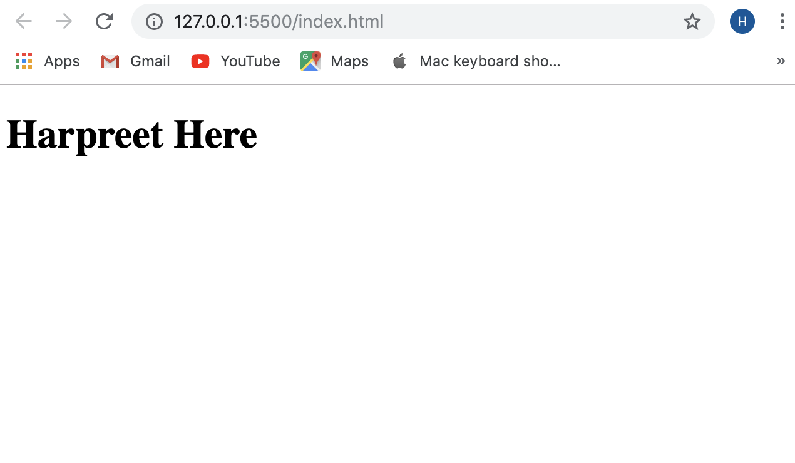

# HTML and CSS 101

### By: Harpreet

* Basic of Html
* How to connect css file



javascript snippet
```javascript
let a=20;
let b=20;
console.log("The final addition is:", a+b);
```
CSS Snippet
``` css
h1{
    background-color:red;
}
```
- [x] wrote the first h1 tag
- [x] connected my css to HTML file
- [] change the background color

made with :heart: in MAD9013